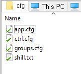

# AutoShill

Automatic Shilling Program for Telegram

# Links

Telegram: https://t.me/AutoShillTG  
Github: https://github.com/AllCoinLab  

# DEMO Videos
How to use DEMO  
https://youtu.be/w5V9rBg2T1g  
  

Working DEMO  
https://youtu.be/XXkYkA9XJ1g  

# Versions
## Windows version: **Launched**
## Web version: **Launched**  

# Introduction

### 🔥🔥🔥 ATTENTION ALL SHILLERS!! 🔥🔥🔥 
  
With this program,  
you can **SHILL** with **MAXIMUM EFFICIENCY** to more groups with **FREE** hands.  
Do other things! rest, play, or find more opportunities.  

For the launch event,
it will be **FREE** to use for all of you.  
Follow the instructions below.

# IMPORTANT
# DO NOT MODIFY ANYTHING WHICH IS NOT MENTIONED 
You may get **PERMANENT BAN** by the Telegram system if you do something which I didn't say.  

# PLEASE READ ALL INSTRUCTIONS BEFORE ASKING ME
As **REALLY MANY** people asking for the issue,  
I cannot answer all things.  
Please read all instructions in here and follow the steps first.  
If you have trouble even if you do that,
DM https://t.me/AllCoinLab is always welcome :)

# Features
### Can shill with your user **ACCOUNT** (also can do with **BOT**)
### Can shill in multiple TG group  
tested for 120+ groups, but adjust yourself because of the TG spam system  
### **NOT** using your computer power (web version)  
You can also run this in your mobile too + turn on/off  
So if you have multiple account,  
you can do all this for multiple projects **WITHOUT LOSS OR ADDITIONAL LOAD** (web version)  
### Optimized msg resend time based on each group's **SLOW MODE**.  
I see many shilling services limit resend msg time like 60~120 seconds.  
This tool runs internal algorithm and regarding the slow mode timer,  
it automatically set optimized msg resend time for each group.  
(tested for no slow mode to 1h slow mode)  
### Add target groups with **GROUP LINK**. No need for **GROUP ID**, etc.  
### **NO INSTALLATION NEEDED**
### Automatically joins the group if listed group is not joined  
Only few group can be joined per day due to TG spam system  
### And many more, just focusing on spreading this tool now.  

# Requirements
Your shilling account **MUST** be joined in this channel:  
https://t.me/AutoShillTG

Follow instructions on section 'Obtaining api_id' in this link to get 'api_id' and 'api_hash':  
https://core.telegram.org/api/obtaining_api_id#obtaining-api-id

### troubleshooting
Incorrect app name&#33  
#1 use alphanumeric, 5-32 characters  
my.telegram.org says ERROR  
#1 Use chrome, not interet explorer or edge  
#2 Not worked by #1, don't use AD block and VPN.  
#3 Not worked by #2, use incognito mode in chrome

# How to use Free Trial
Fill out this form with 'api_id'
Then you will get 1 day free trial for this program.  
https://docs.google.com/forms/d/10PIpUIbkn-6pAGxLB5abg_i8isj3gByYV7DWbN55rMI

Try adding it in my working hour  
00:00 to 15:00 GMT  

# Paid version will be released
After the free trial,  
you can extend your experience using this tool by payment.  

# Price list
Based on many shillers opinion,  
price will be like below:  
**0.1 BNB for 1 day**  
**0.5 BNB for 7 day**    
all based on per account. (TBD)

# Instruction
There are 2 versions, web version and windows version.  

1. windows version  
Easy to use  
Access / control with mobile phone needs remote app  

2. web version  
Uses google web so it does **NOT** consume your computer power  
Can be accessed / controlled with mobile phone  
Can use multiple account with no loss or load on your computer  

# Instruction for the windows version

1. Go to github
https://github.com/AllCoinLab/AutoShill

3. Clone the repository or download zip file  
(Search google how to do this will be easier for you)

4. Fill all the infos in the folder

4-1. cfg/app.txt  
Write down api_id, api_hash and phone number

4-2. cfg/ctrl.txt  
Set values to control this program

4-2. cfg/groups.txt  
Write down all group links you want to shill like examples given
##### You can write down based on @ link or full link
##### MAKE SURE each groups are separated by at least ONE SPACE or NEWLINE
##### Other than that, you don't need to care for some orders or something
##### No need to care for space, newline count between groups.
##### Just make sure at least ONE SPACE or NEWLINE
##### Also no need to care for uppercase

4-3. cfg/shill.txt  
Write down shill text

5. Double click tg.exe

6. Input code will be asked to you.
And telegram will send you the login code.
Write in down.
And it will never be asked again in normal cases.

7. Check shilling is being processed (DEMO video)  
https://youtu.be/XXkYkA9XJ1g

8. **Enjoy 24/7 Shilling :)**

# Instruction for the web version

1. Open this link  
https://colab.research.google.com/drive/1RSpC0acWMPn0oju-AhuiXW5AGwp1xy01?usp=sharing

3. Login with your google account  
This is one of Official Google Page, check yourself :)  
(Ignore if you have already logged in.)

3-1. If you want to save it and use again, 
Click 'Copy to Drive' at the top menu.  

3-2. When copy to drive worked, save the url for the future use.
### You can also access this url by mobile phone

4. Fill all the infos in the web page

4-1. /content/AutoShill/cfg/app.txt  
Write down api_id, api_hash and phone number

4-2. /content/AutoShill/cfg/ctrl.txt  
Set values to control this program

4-2. /content/AutoShill/cfg/groups.txt  
Write down all group links you want to shill like examples given
##### You can write down based on @ link or full link
##### MAKE SURE each groups are separated by at least ONE SPACE or NEWLINE
##### Other than that, you don't need to care for some orders or something
##### No need to care for space, newline count between groups.
##### Just make sure at least ONE SPACE or NEWLINE
##### Also no need to care for uppercase

4-3. /content/AutoShill/cfg/shill.txt  
Write down shill text

5. Follow instruction of this demo video  
https://youtu.be/w5V9rBg2T1g
### EDIT: no need to input phone number at this step now
Input code will be asked to you.
And telegram will send you the login code.
Write in down.
And it will never be asked again in normal cases.

6. Check shilling is being processed (DEMO video)  
https://youtu.be/XXkYkA9XJ1g

7. **Enjoy 24/7 Shilling :)**

+ Some people reported that web provided by google consistently checks activity of the user  
If this happens, runtime will be closed with popup message.
But you can ignore captcha msgs.  
But you may need to stop and play the last button in **6 HOURS** due to account based activity checking system.  
So if you think this is happening to you,  
do below process.  
start the last play button - (around before 6 hours) - stop the last play button - start the last play button - (repeat)

# Some Tips
Before the mute, TG system usually sends warning message.  
This tool will display those warnings.  
So some warning happens primarily based on spam / flood / etc,  
it is recommended to stop for a few moment and restart.

# FAQ
warning msgs below should restart the runtime  
databased is locked  

1. Spam / Flood warning message happens  

It is sign for the mute / ban,  
erase some shill group or increase 'SLEEP' value

Sometimes TG system applies the mute / ban without warning message.  
This can be caused by user report.  
As it cannot be avoided as there is no prior notice,  
I recommend you to erase more shill group and increase 'SLEEP' value

# DISCLAIMER
This is made for the shillers to shill more effectively and efficiently.  
If you use too much in too much TG groups with too much accounts,
it may lead unexpected results by the TG system. (ex. mute / ban)  
This tool is tested with many situations.  
(Up to 130+ groups for 24+ hours)  
But it may differ because of the various slow mode cooldown for each group.
+ many environment / situation of your account / computer

This tool has some safety methods to avoid it,  
but this is not responsible for those unexpected results.  
It is up to **YOU** to adjust using time and target group counts to avoid it.

# Other Project
Check my other projects too :)  
HoneyProof: Checks honeypot tokens  
https://github.com/AllCoinLab/honeyproof

